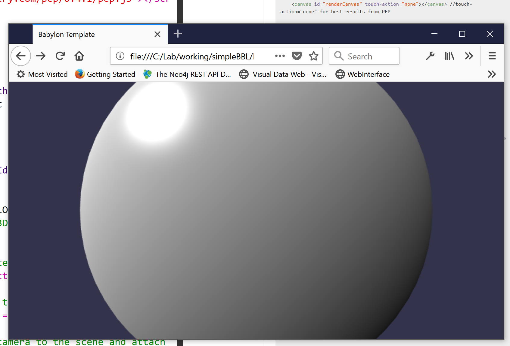

# BABYLONJS

## Getting started

So we can take the sample from http://doc.babylonjs.com/babylon101/first and run that just by calling it in a local HTML page.  The code appears as follows

```html
<!DOCTYPE html>
<html xmlns="http://www.w3.org/1999/xhtml">

   <head>
      <meta http-equiv="Content-Type" content="text/html; charset=utf-8"/>
      <title>Babylon Template</title>

      <style>
        html, body {
            overflow: hidden;
            width: 100%;
            height: 100%;
            margin: 0;
            padding: 0;
        }

        #renderCanvas {
            width: 100%;
            height: 100%;
            touch-action: none;
        }
    </style>

    <script src="https://cdn.babylonjs.com/babylon.js"></script>
    <script src="https://code.jquery.com/pep/0.4.1/pep.js"></script>

   </head>

   <body>

    <canvas id="renderCanvas" touch-action="none"></canvas> //touch-action="none" for best results from PEP

    <script>

            var canvas = document.getElementById("renderCanvas"); // Get the canvas element 

            var engine = new BABYLON.Engine(canvas, true); // Generate the BABYLON 3D engine


            /******* Add the create scene function ******/
            var createScene = function () {

                        // Create the scene space
                        var scene = new BABYLON.Scene(engine);

                        // Add a camera to the scene and attach it to the canvas
                        var camera = new BABYLON.ArcRotateCamera("Camera", Math.PI / 2, Math.PI / 2, 2, BABYLON.Vector3.Zero(), scene);
                        camera.attachControl(canvas, true);

                        // Add lights to the scene
                        var light1 = new BABYLON.HemisphericLight("light1", new BABYLON.Vector3(1, 1, 0), scene);
                        var light2 = new BABYLON.PointLight("light2", new BABYLON.Vector3(0, 1, -1), scene);


                        // Add and manipulate meshes in the scene
                        var sphere = BABYLON.MeshBuilder.CreateSphere("sphere", {diameter:2}, scene);

                        return scene;
                };

                /******* End of the create scene function ******/    

                var scene = createScene(); //Call the createScene function

            engine.runRenderLoop(function () { // Register a render loop to repeatedly render the scene
                    scene.render();
            });


            window.addEventListener("resize", function () { // Watch for browser/canvas resize events
                    engine.resize();
            });
    </script>

   </body>
</html>
```

and with that we obtain a ball displayed on a web page.




So here we have a web page that has a defined script that runs babylon.js to display the ball.


