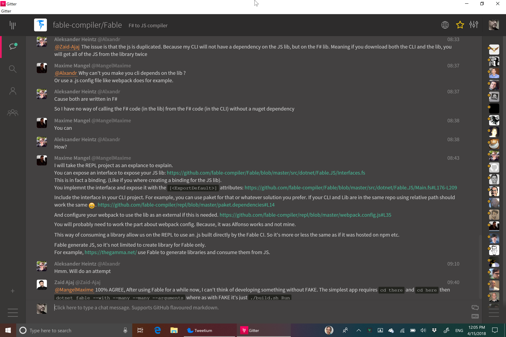

# Fable

## Setting up Fable

Currently, the simple way to install Fable is to use the fable template from dotnet.  The question I have, however, is how do I add fable to an existing project?  Is fable in the npm registry?

## Connecting a library to a FSI interface and JS code

